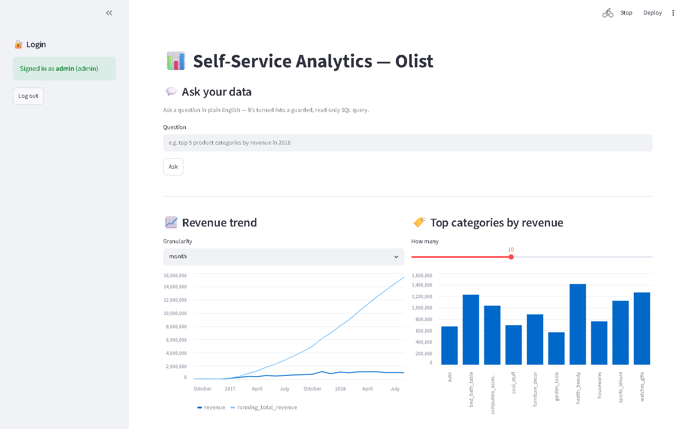
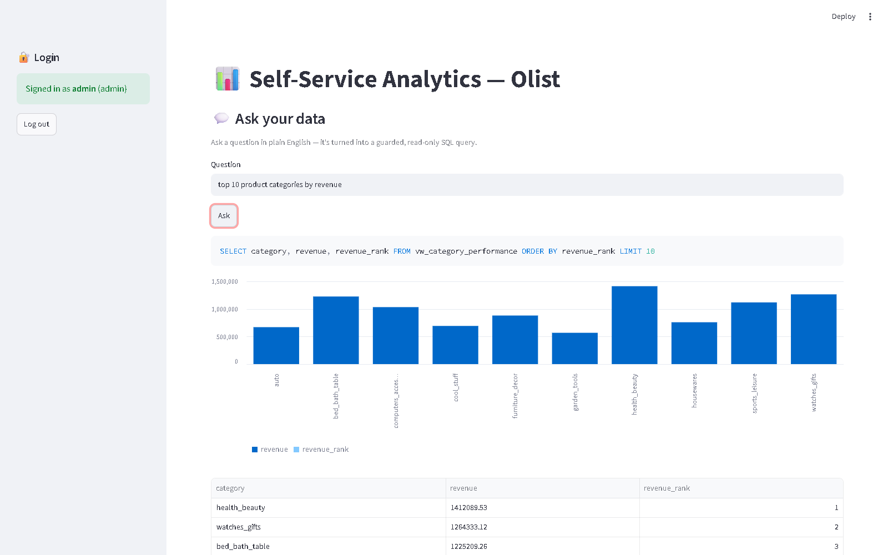

# Self-Service Analytics Platform

A cloud-ready analytics platform on the **Brazilian E-Commerce (Olist)** dataset: a
PostgreSQL warehouse with analytical SQL views, a FastAPI reporting backend exposing
KPI endpoints, **JWT role-based access control with an audit log**, and an
**LLM-powered natural-language-to-SQL assistant with injection guardrails** — all
fronted by a Streamlit dashboard and containerised for deployment.

```
Dashboard (Streamlit)  ──REST + JWT──▶  FastAPI backend  ──parameterised SQL──▶  PostgreSQL
  charts + "Ask your data"              /metrics/*  /query  /nl-query             star schema + views
                                        auth · RBAC · audit log
                                            │
                                            └─ /nl-query ──▶ Google Gemini (NL → guarded SQL)
```

---

## Screenshots

**Dashboard** — a chart for every KPI endpoint:


<!-- placeholder: add docs/dashboard.png (Streamlit dashboard with the metric charts) -->

**"Ask your data"** — natural-language question → generated SQL (shown for transparency) → results:


<!-- placeholder: add docs/nl2sql.png (the Ask-your-data box showing a question, the SQL, and the table/chart) -->

---

## What it demonstrates

| Component | Skill shown |
|---|---|
| Relational warehouse + analytical SQL (window functions, views) | SQL, data modelling |
| FastAPI reporting backend (`/metrics/*`) | Backend services, business logic in a reporting layer |
| JWT auth + 3 roles + audit log | Managing access rights, roles & permissions |
| Streamlit dashboard | Business intelligence / reporting |
| NL-to-SQL assistant with guardrails | Applied GenAI on a real data platform |
| Docker + docker-compose, cloud-ready | Cloud architecture / data platforms |

---

## Quick start (local, Docker)

```bash
cp .env.example .env          # set GEMINI_API_KEY (or LLM_PROVIDER=echo to skip the LLM)
#  ensure the 9 Olist CSVs are in data/raw/  (see Dataset below)
docker compose up
```

This brings up Postgres, runs the one-shot **loader + auth seed**, then starts the
API and dashboard:

- API + interactive docs → **http://localhost:8000/docs**
- Dashboard → **http://localhost:8501**  (log in with `admin` / `admin123`)

`docker compose down` stops everything; the data volume is kept.

> Prefer running without Docker (venv + uvicorn + streamlit)? See **[HOW_TO_RUN.md](HOW_TO_RUN.md)**.

---

## Dataset

[Brazilian E-Commerce Public Dataset by Olist](https://www.kaggle.com/datasets/olistbr/brazilian-ecommerce)
— ~100k real orders across 9 linked tables. Download and unzip the CSVs into
`data/raw/`. They are gitignored (not committed).

---

## API surface

| Endpoint | Role | Purpose |
|---|---|---|
| `POST /auth/login` | any | exchange username/password for a JWT |
| `GET /metrics/revenue` `…/categories/top` `…/aov` `…/delivery-sla` `…/sellers/scorecard` `…/repeat-customers` | viewer+ | pre-computed KPIs ready to chart |
| `POST /query` | analyst+ | run vetted read-only SQL against `analytics` |
| `POST /nl-query` | analyst+ | natural-language question → guarded SQL → rows |
| `GET/POST/PATCH/DELETE /admin/users`, `GET /admin/audit-log` | admin | manage users; read the audit log |

Roles: **viewer** (read metrics) ⊂ **analyst** (+ `/query`, `/nl-query`) ⊂ **admin** (+ user management & audit log).

---

## Design decisions

### Why a star schema
Raw CSVs land in a `raw` schema untouched (a faithful, reloadable landing zone).
The `analytics` schema then models a star: a single fact table `fct_order_items`
(grain = one order line, with computed `item_revenue`, `delivery_days`, `on_time`)
surrounded by conformed dimensions (`dim_product` with English category,
`dim_customer`, `dim_seller`, `dim_date`). Pre-aggregated views
(`vw_monthly_revenue`, `vw_category_performance`, `vw_seller_scorecard`,
`vw_delivery_sla`) push the business logic into SQL — including **window functions**
(running-total revenue, month-over-month growth, category rank by revenue) — so the
API stays thin and the analytical depth is visible in the data layer.

### How the RBAC guards work
Auth is JWT (HS256); passwords are hashed with stdlib **PBKDF2** (no compiled-crypto
dependency). A single FastAPI dependency, `authorized(*roles)`, gates every protected
router: it resolves the bearer token to an active user, **writes an audit row for the
decision (allowed *and* denied)**, then enforces the role — so access control and the
audit trail can't drift apart. The audit log (`app.audit_log`) records who ran what
and when, which turns "manages roles & permissions" into a demonstrated feature rather
than a claim.

### How the NL-to-SQL injection guardrails work
`/nl-query` puts the LLM behind a small swappable adapter (`GeminiAdapter`, using
Google's `google-genai` SDK with a structured-JSON schema so the model returns clean
SQL). The model's output is **never trusted** — it must clear every guardrail in
`sql_guard.py` before running: a **single statement** (no stacked `;`), **no SQL
comments**, must **start with SELECT/WITH**, a **DML/DDL keyword blocklist**, and a
**table allow-list** restricting references to `analytics` objects only. A hard
**`LIMIT`** is wrapped around the final query. Independently, execution happens on a
dedicated **read-only PostgreSQL role** (`analytics_ro`) with SELECT-only rights on
`analytics` and no reach into `raw`/`app` — so even a guardrail bypass hits a database
permission wall. The generated SQL is returned to the UI for transparency.

---

## Tests

```bash
pytest -q          # 45 tests: metric logic, RBAC allow/deny matrix, and NL-to-SQL guardrails
```

The guardrail tests feed malicious "model output" (writes, stacked statements,
disallowed tables) through a fake adapter and assert each is rejected — no API key needed.

---

## Deploy (cloud container service)

The image is cloud-run-friendly (binds `$PORT`). Deploy **three** services from this
one repo/image:

1. **PostgreSQL** — a managed instance (Neon, Supabase, RDS, Cloud SQL) or a container.
2. **API** — start command `uvicorn src.api.main:app --host 0.0.0.0 --port $PORT`.
3. **Dashboard** — start command `streamlit run dashboard/app.py --server.address 0.0.0.0 --server.port $PORT`.

Run the loader/seed once against the cloud DB (`python -m src.warehouse.load` then
`python -m src.api.auth.manage init`) as a one-off job.

**Environment variables**

| Service | Variables |
|---|---|
| API | `POSTGRES_HOST/PORT/USER/PASSWORD/DB`, `JWT_SECRET`, `LLM_PROVIDER`, `LLM_MODEL`, `GEMINI_API_KEY` |
| Dashboard | `API_BASE_URL` (public URL of the API) |
| DB | `POSTGRES_USER/PASSWORD/DB` |

---

## Build order (milestones)

1. **Warehouse** — Docker Postgres, schema, CSV loader, analytics views with window functions ✅
2. **Reporting API** — `/metrics/*` over the views, pytest coverage ✅
3. **Auth + RBAC** — users, roles, JWT, dependency guards, audit log ✅
4. **NL-to-SQL** — `/nl-query` with strict guardrails and guardrail tests ✅
5. **Dashboard** — charts per metric + the "Ask your data" box ✅
6. **Deploy** — containerise the stack + this README ✅

---

> **Resume bullet:** Built a self-service analytics platform — a PostgreSQL warehouse
> with analytical SQL views, a FastAPI reporting backend exposing KPI endpoints, JWT
> role-based access control with an audit log, and an LLM-powered natural-language-to-SQL
> assistant with injection guardrails; containerised with Docker Compose and deployable
> to a cloud container service.
